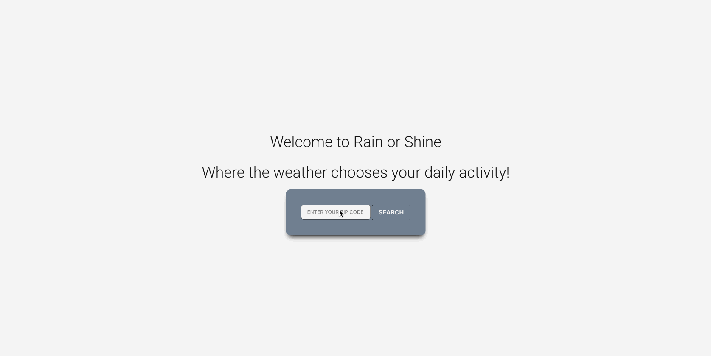

# rain-or-shine

Description:
  Rain or Shine is an application that will help users discover nearby activities that are appropriate for the current weather conditions.
  
Deployed Link: https://darrinling.github.io/rain-or-shine/

Technologies Implemented:
  HTML, JAVASCRIPT, BULMA, CSS, JQUERY

Project collaborators: Darrin, Krys, Matt, Norman
